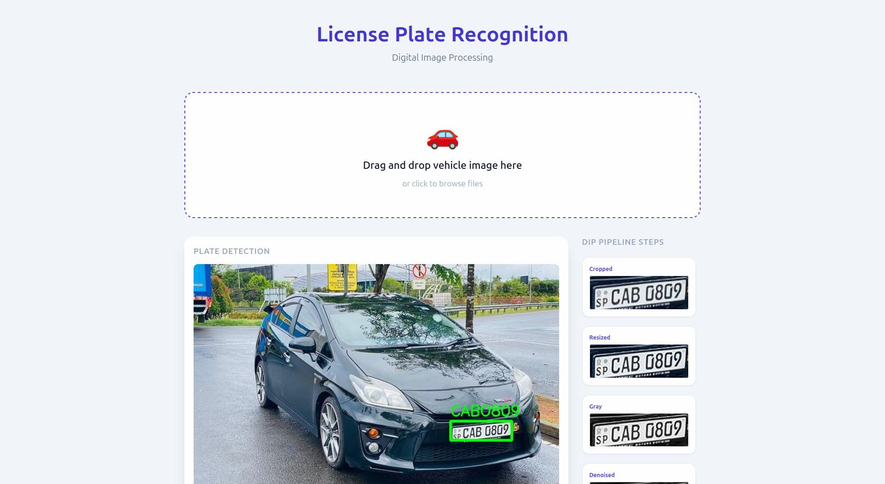
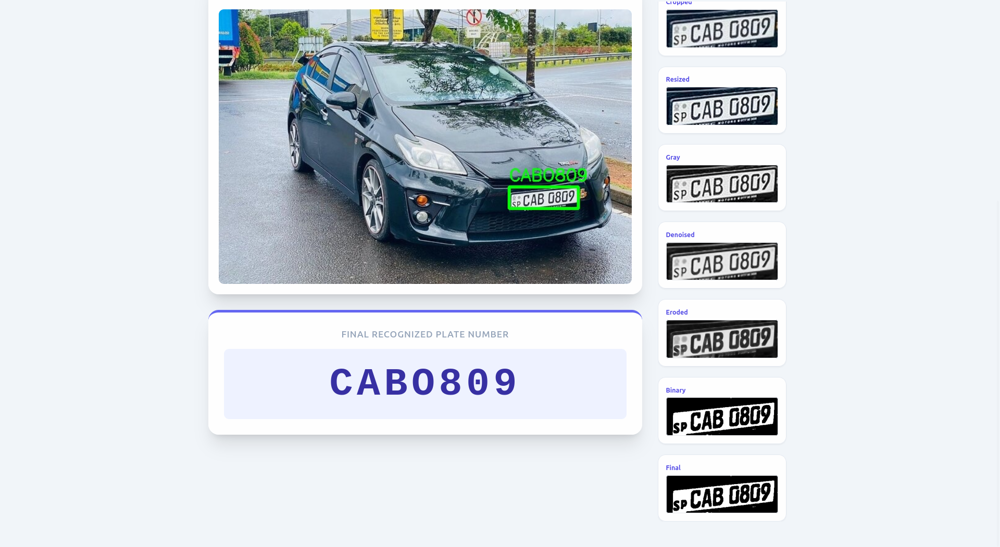

# Number Plate Recognition System

A lightweight, OpenCV based tool for Number Plate Recognition (ANPR) and Reading. This project uses YOLOv3 for vehicle/plate detection and Tesseract OCR for character recognition.

---

## 📸 Screenshots





---

## 🚀 Features
- **Vehicle Detection:** Uses YOLOv3 (Darknet) to identify vehicles and plates.
- **Image Processing:** Adjustable pipeline for grayscale conversion, noise reduction, thresholding and other preprocessings.
- **OCR engine:** Tesseract configuration for license plate alphanumeric strings.
- **Web Interface:** Easy-to-use Flask UI for uploading and processing images.

---

## 🛠️ Tech Stack
- **Python 3.12**
- **Flask** (Web Framework)
- **OpenCV** (Image Processing)
- **PyTesseract** (OCR Engine)
- **PDM** (Package & Dependency Manager)

---

## 📦 Setup & Installation

- Install **Python 3.12**
- Install **Tesseract OCR** on your system:
  ```bash
  sudo apt update
  sudo apt install tesseract-ocr
  # or similar based on your system
  ```
- Install **Project dependancies**:
  ```bash
  pdm install
  ```

___

## 📜 Credits & Acknowledgments

This project utilizes the **YOLOv3** object detection architecture. 

* **Model Architecture:** YOLOv3 (You Only Look Once) by Joseph Redmon and Ali Farhadi.
* **Framework:** [Darknet](https://pjreddie.com/darknet/yolo/), an open-source neural network framework written in C and CUDA.
* **Weights & Config:** These parameters are based on the original pre-trained weights released into the **Public Domain** by the authors.

Special thanks to the open-source community for maintaining various implementations of the Darknet weights and configurations.
